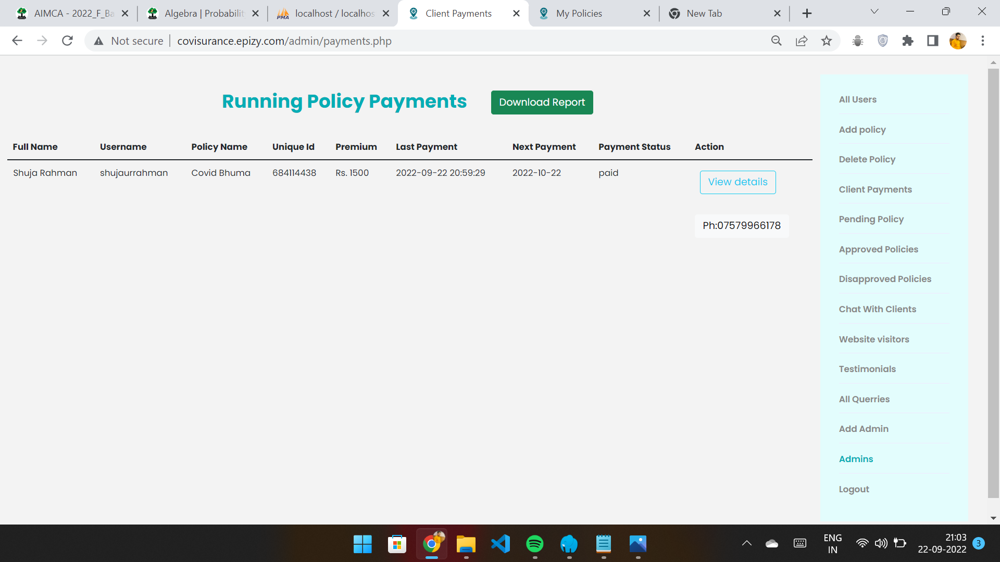
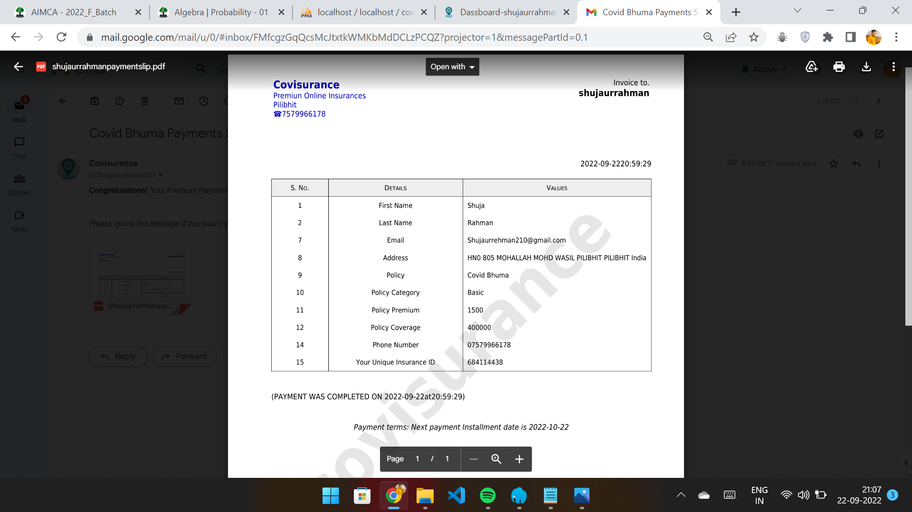

# 🛡 COVISURANCE - [WATCH VIDEO](https://youtu.be/XKXHp2Q8Lw4)
**WATCH VIDEO FOR DETAILED EXPLANATION**

**COVISURANCE** a **WEB BASED APPLICATION** insurance platform to get instant **Premium Cover** Online without stepping out of home.

# 🔴 Problem Statement:
Medical treatment is one of the major expenses in one’s life. Getting hospitalized brings with it a great financial need urgently.
For this people invest in health insurance but in today’s scenario getting claims from the insurance companies have become a very time taking process. 
This problem has majorly scaled up during the Covid-19 situation. God-forbid, anyone gets Covid-positive there is an *urgent need for money* for tests, 
ambulance service, medication, oxygen etc. and even after demise, the family members must get their claims as soon as possible to continue their livelihood. 
**Our solution will increase the ease of getting health claims and greatly reduce the time span of the process for the wellbeing of the people.**

## 🟡 Idea Description: COVISURANCE
The main objective of Covisurance is to automate process of application and claim between admin and user. The process is minial and secure and totally online 
with no-visit service of any kind. Website offers registration of user to sign in and build thier profile, Update details and profile pic etc
payments gateway enable user to pay thier premium EMI without being driven out of thier home just by one click button available on dashboard which is intern secure by razopay.
Claim process is minial and every next step of process is updated at profile and my policy section and in admin dashboard.
Contact us and testimonials section are also available for querries and reviews which user can post.
  

##### Admin panel:
###### (Hidden feature that only admins can access)  
- See All the Registered user on Website in a tabulated form.
- Add new policies to the website.
- Delete any Policy on Website
- Approve/Disapprove User policy by viewing application once user has claimed from pending section
- View all the disapproved applications also view specific disapproved application details.
- View all the approved applications also view specific approved application details.
- View all the user Querries.
- Clear the querries/ Delete aprroved/Disapproved applications 

###### To login as Admin 
username = Adminshuja 
adminPassword = Opssasur@786 
(Username and password both are Case sensitive.) 

##### User panel:
- Register/Sign Up.
- Authetication of Email using SMTP 
- Sign in and View User profile.
- Reset Password by email authentication (SMTP).
- Update profile pic or update details.
- Change Password.
- Apply any Policy from User profile Dassboard.
- Pay premium EMI of Current Policy -> Secure razopay gateway.
- Claim the insured Policy.
- View all the applied policy in My policy.
- Download the soft copy of Applied Policy.
- Mail soft copy of current policy to your registered email.
- Chat with other users, Discuss policies with them.
- Chat with admin in case of any problem.
- Get dedicated Notification for every activity in  Notification panel.
- Get Notification Incase anyone tries to login your account.
- Incase admin is not online Send your detail Querry with problem Explanation through-> Contact Us
- Post testimonial that will be displayed at the home page.

##### ANY ONE:
- View all the Policies Available on website
- Send Question to admin through Contact us section.
- Post Testimonials/Review

For more look in snapshots. 

### How to run Locally?
⚡Steps:
- Clone the repository.
- Find covisurance.sql file and import the sql to phpmyadmin
- copy and paste folder in htdocs i.e Xampp 
- open your browser
- Copy and past: In xampp or laragone or whatever you use.
- http://localhost/htdocs/index.php
- Now you are good to go .
- pull request .
- contribute and refine code and bugs

### Languages and Tools:

 
-Frontend

   

-Behavior
  

-Backend and Data 
  
   

-Authentication(THROGUH EMAIL OTP ->PHP MAILER)

   

## Snaptshots

### Let's Connect :coffee:

	
	
	
	
  

Developed by 
- Shuja ur Rahman  
- ©Shuja ur Rahman  
 📫Reach me: **shujaurrehman210@gmail.com** 
 👨‍💻check out my portfolio at:[shuja-on-web](https://shujaurrahman.github.io/shuja-on-web/) 

